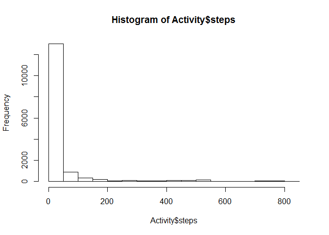
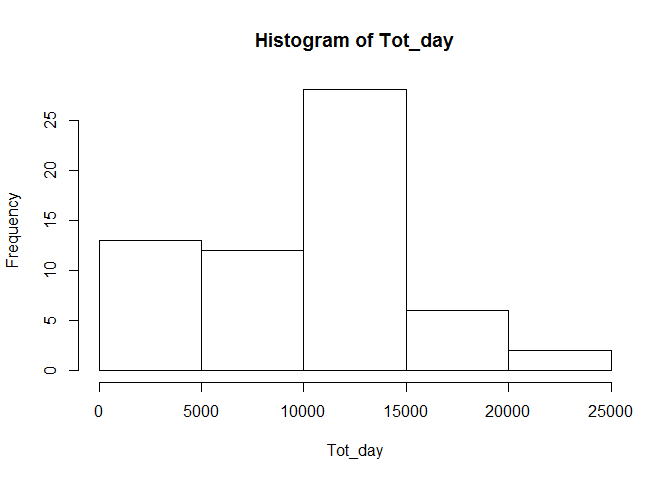
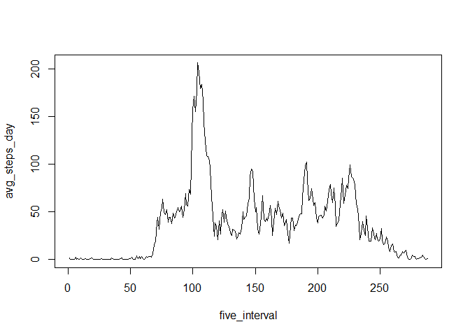
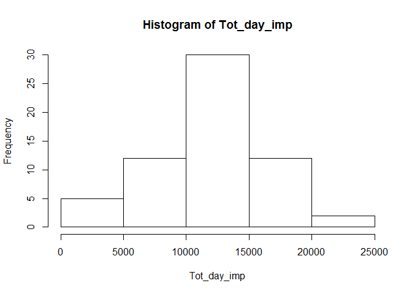
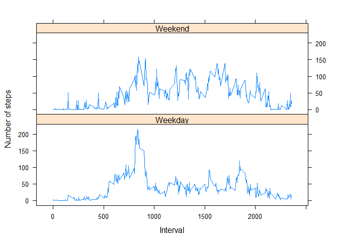

# Reproducible Research: Peer Assessment 1
In this project we are going to use the data from a personal activity monitoring device. This device collects data at 5 minute intervals through out the day. The data consists of two months of data from an anonymous individual collected during the months of October and November 2012 and include the number of steps taken in 5 minute intervals each day.
This data can be downloaded at the course website.

The dataset has three variables:  
-steps: Number of steps taking in a 5-minute interval  
-date: The date on which the measurement was taken in YYYY-MM-DD format  
-interval: Identifier for the 5-minute interval in which measurement was taken  
Note: missing values in this dataset are coded as NA.

## Loading and preprocessing the data  


```r
knitr::opts_chunk$set(echo = TRUE)

Activity <- read.csv('activity.csv', stringsAsFactors = FALSE)
dim(Activity)
```

```
## [1] 17568     3
```

```r
str(Activity)
```

```
## 'data.frame':	17568 obs. of  3 variables:
##  $ steps   : int  NA NA NA NA NA NA NA NA NA NA ...
##  $ date    : chr  "2012-10-01" "2012-10-01" "2012-10-01" "2012-10-01" ...
##  $ interval: int  0 5 10 15 20 25 30 35 40 45 ...
```

```r
head(Activity,3)
```

```
##   steps       date interval
## 1    NA 2012-10-01        0
## 2    NA 2012-10-01        5
## 3    NA 2012-10-01       10
```

```r
tail(Activity,3)
```

```
##       steps       date interval
## 17566    NA 2012-11-30     2345
## 17567    NA 2012-11-30     2350
## 17568    NA 2012-11-30     2355
```

```r
Activity$date <- as.Date(Activity$date)
summary(Activity)
```

```
##      steps             date               interval     
##  Min.   :  0.00   Min.   :2012-10-01   Min.   :   0.0  
##  1st Qu.:  0.00   1st Qu.:2012-10-16   1st Qu.: 588.8  
##  Median :  0.00   Median :2012-10-31   Median :1177.5  
##  Mean   : 37.38   Mean   :2012-10-31   Mean   :1177.5  
##  3rd Qu.: 12.00   3rd Qu.:2012-11-15   3rd Qu.:1766.2  
##  Max.   :806.00   Max.   :2012-11-30   Max.   :2355.0  
##  NA's   :2304
```

```r
hist(Activity$steps)
```

<!-- -->

## What is mean total number of steps taken per day?  

```r
knitr::opts_chunk$set(echo = TRUE)
Tot_day <- tapply(Activity$steps, Activity$date, sum, na.rm=TRUE)
hist(Tot_day)
```

<!-- -->

```r
mean(Tot_day, na.rm = TRUE)
```

```
## [1] 9354.23
```

```r
median(Tot_day, na.rm = TRUE)
```

```
## [1] 10395
```
The mean of the total number of steps taken per day is  9354.23 and the median is 10395.  

## What is the average daily activity pattern?  

```r
knitr::opts_chunk$set(echo = TRUE)
avg_steps_day <- tapply(Activity$steps, Activity$interval, mean, na.rm=TRUE)
which.max(avg_steps_day)
```

```
## 835 
## 104
```

```r
five_interval <- 1:288
df <- data.frame(five_interval, avg_steps_day)
plot(five_interval, avg_steps_day, type = 'l')
```

<!-- -->

On average, across all days in the dataset, the 5 minute-interval that contains the maximum number of steps is the interval 835.  

## Imputing missing values  

```r
sum(is.na(Activity))
```

```
## [1] 2304
```

```r
library(mice)
```

```
## Loading required package: Rcpp
```

```
## mice 2.25 2015-11-09
```

```r
set.seed(123)
Impute_Activity <- complete(mice(Activity[, c(1,3)]))
```

```
## 
##  iter imp variable
##   1   1  steps
##   1   2  steps
##   1   3  steps
##   1   4  steps
##   1   5  steps
##   2   1  steps
##   2   2  steps
##   2   3  steps
##   2   4  steps
##   2   5  steps
##   3   1  steps
##   3   2  steps
##   3   3  steps
##   3   4  steps
##   3   5  steps
##   4   1  steps
##   4   2  steps
##   4   3  steps
##   4   4  steps
##   4   5  steps
##   5   1  steps
##   5   2  steps
##   5   3  steps
##   5   4  steps
##   5   5  steps
```

```r
Impute_Activity$date <- Activity$date
Tot_day_imp <- tapply(Impute_Activity$steps, Impute_Activity$date, sum, na.rm=TRUE)
```

The total number of missing values is 2304.  

MICE (Multivariate Imputation via Chained Equations) is one of the commonly used package by R users.

MICE assumes that the missing data are Missing at Random (MAR), which means that the probability that a value is missing depends only on observed value and can be predicted using them. It imputes data on a variable by variable basis by specifying an imputation model per variable.

```r
knitr::opts_chunk$set(echo = TRUE)
hist(Tot_day_imp)
```

<!-- -->

```r
mean(Tot_day_imp)
```

```
## [1] 11601.9
```

```r
median(Tot_day_imp)
```

```
## [1] 11458
```
The mean of the total number of steps taken after imputing the dataset is 11601.9 and the median is 11458. Compared to the values obtained before imputation there is a difference, and looking at the histogram the imputation seems to improve the distribution of the steps taken, imputing certainly has an impact on the distribution of the estimates of the total daily number of steps, these two values (mean and median) do not differ that so much implying more or less a normal distribution.  

## Are there differences in activity patterns between weekdays and weekends?  

```r
knitr::opts_chunk$set(echo = TRUE)
library(lattice)
days <- weekdays(Impute_Activity$date)
Impute_Activity$day_type <- ifelse(days == "Saturday" | days == "Sunday", "Weekend", 
                           "Weekday")
meansteps <- aggregate(Impute_Activity$steps, by = list(Impute_Activity$interval, Impute_Activity$day_type), mean)
names(meansteps) <- c("interval", "day_type", "steps")
xyplot(steps ~ interval | day_type, meansteps, type = "l", layout = c(1, 2), 
       xlab = "Interval", ylab = "Number of steps")
```

<!-- -->
